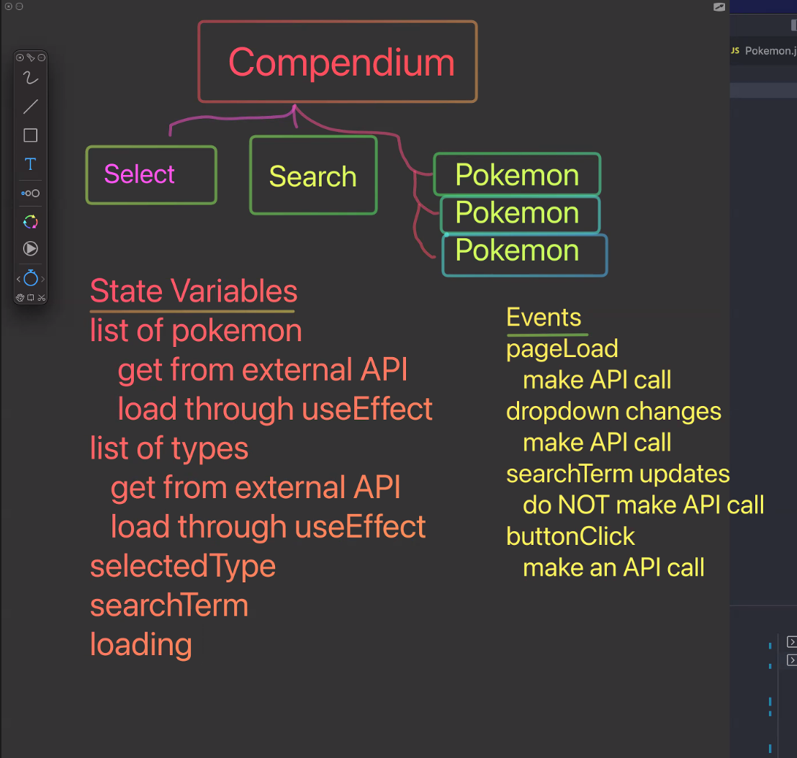

# Shan and Dave's Pokemon Adventure Pokedocs

## Component Hierarchy

- Collection -- main component
- Select -- generic dropdown component
- Search -- generic search component
- Gladiators -- display Pokemon details

## State

- gladiators -- loaded from api
- types -- loaded from api
- selectedType -- controlled by Select component
- searchTerm -- controlled by Search component
- loading -- boolean

## Events

- page load -- load the initial list of Pokemon and the list of types (useEffect)
- select change -- update the selectedType state, and also reload the pokemon (make an API call)
- search input change -- updated teh searchTerm state but will NOT call the API
- search button click -- call the API with the search term

## Plan

### 1 Load initial list of Gladiators

- Make Collection component
- Create custom hook usePokemon for loading pokemon (including services function)
- Use the custom hook in Collection component and display Gladiator component for each item

### 2 Get Select Working

- Create Select Component
- add state to usePokemon for selectedType and types
- load list of types and pass to Select component
- add event handler for the type changing

### 3 Get Search Working

- Create Search component
- add state to usePokemon for searchTerm
- add event handler for clicking search button

